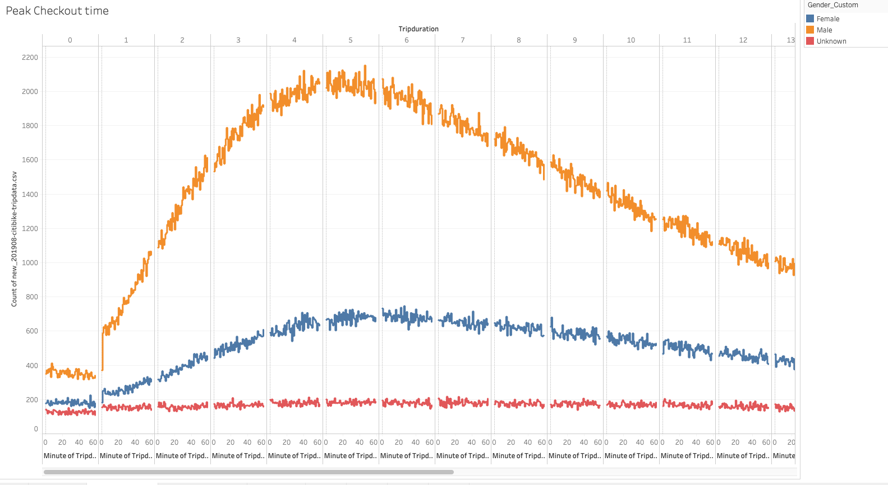

##Bikesharing

[Bikisharing Dashboard](https://public.tableau.com/profile/arshi.singh#!/vizhome/Challenge_Module14/Dashboard1?publish=yes)

### Purpose
-	The purpose of this analysis was to see if it is feasible to start a bike sharing business in Des Moines, Iowa.

### Results 

The dashboard above summarizes the total number of trips in the month of August, Peak start time, Peak checkout time, and volume of tips by hour of day. The filters include gender and user type. 

- Peak Start time

As seen in the chart, the most populate times to start the usage of a bike are 8amm and 5-6pm. This is primarily due to commuting for business hours on a weekday. 

- Peak Checkout Time

The peak check out time is about 4-6 hours. Making sure the bikes are in prime condition before the peak start times is crucial so they can last at least 6 hours.

-
The heat map below shows the usage rate by hour for each day. As expected, the most usage is on weekdays by Subscribers. 
Customers seem to use the bikes more on weekends. 
The filters allow the same heatmap to be utilized for multiple purposes. 

### Summary

The majority of the usage is by males on weekdays during start and end of a business day. NYC may not be the best reference point to start a ride sharing business. NYC has a population over 8 million as opposed to less than 250,000 in Des Moines. 
More data needs to be gathered before launching this concept.

#### Recommendations

1. Gather data on commute times in Des Moines. Ridesharing is most popular in location with heavy commute times. 

2. Data on bike life expectancy and repairs is also needed to make a conclusive decision.  

